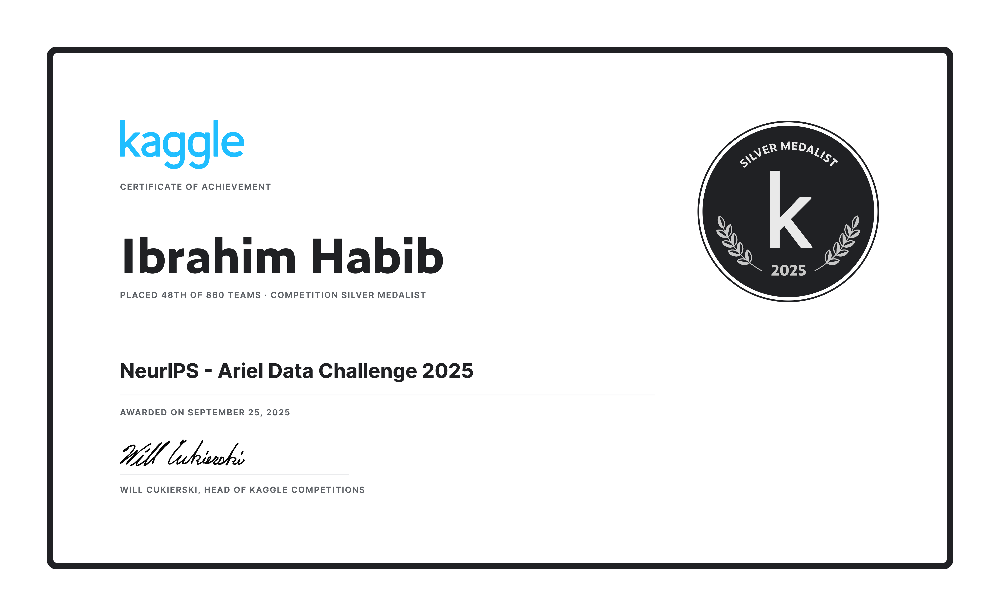

# NeurIPS - Ariel Data Challenge 2025 Silver Medal Solution (48th / 860 teams)

[](https://www.kaggle.com/certification/competitions/ibrahimhabibeg/ariel-data-challenge-2025)

This repo includes my code and solution for the [NeurIPS - Ariel Data Challenge 2025](https://www.kaggle.com/competitions/ariel-data-challenge-2025). In the competition I placed 48th out of 860 teams and managed to secure a [Silver medal](https://www.kaggle.com/certification/competitions/ibrahimhabibeg/ariel-data-challenge-2025).

## Problem Overview

The goal of this competition is to extract the true exoplanet spectrum from noisy data collected (or more precisely simulated) by two sensors in [Ariel](https://www.esa.int/Science_Exploration/Space_Science/Ariel).

The input data are recorded by two sensors: AIRS (a spectrometer) and FGS (a photometer). We are tasked with extracting the $(\frac{R_p}{R_s})^2$ value for 283 wavelengths (1 coming from FGS and 282 from AIRS). This value can be calculated from the per wavelength transit depth.

The noise in the recorded data is the main challenge that we are tasked to overcome.

For each of the 283 wavelengths, we have to predict two values: the expected value and its uncertainty. The evaluation metric is a scaled version of the Gaussian Log-Likelihood (GLL).

## Repo Structure

```
├── ariel_pred
├── data
├── data_download
├── models
├── notebooks
├── scripts
├── README.md
└── pyproject.toml
```

This project was created using the [Cookiecutter Data Science](https://drivendata.github.io/cookiecutter-data-science/) project template and have been modified to suit my needs. The repo structure is as follows:

The project contains the following directories:

- `ariel_pred/`: This is the main package containing all code used for data calibration, processing, feature engineering, model training, and inference. This package is used extensively in both the scripts and notebooks.
- `data/`: This directory is used to store the data files. Due to the large size of the data, it is empty in the repo. The next section explains how to download the data and where to place it.
- `data_download`: Contains a bash script to download subsets of the raw data from Kaggle directly. Note that the full raw dataset is around 264.3 GB making it difficult to download on local machines.
- `models/`: This directory is used to store the trained models. Since all used models are cheap and fast to train, this directory is empty in the repo, and models were trained on Kaggle directly when needed for submissions.
- `notebooks/`: This directory contains Jupyter notebooks used for exploration, prototyping, analysis, visualization, experimentation, and code testing. These notebooks are more or less of scratchpads used during code development. The actual code is in the `ariel_pred/` package and the `scripts/` directory.
- `scripts/`: Each file in this directory contains a CLI app built using [Typer](https://typer.tiangolo.com/) to implement a certain modeling pipeline. Each app contains the full pipeline from data calibration until running inference on the test set and generating a submission file. They are meant to be run on Kaggle directly, but they can also be used locally if the data is available.

## Local Setup

This repo uses [uv](https://docs.astral.sh/uv/) for dependency management. To set up the project locally, follow these steps:

1. Clone the repo:

   ```bash
   git clone https://github.com/ibrahimhabibeg/ariel-2025.git
    cd ariel-2025
   ```

2. Install the dependencies:

   ```bash
   uv sync
   ```

3. Download the data:

   - Register in the [competition](https://www.kaggle.com/competitions/ariel-data-challenge-2025) and accept the rules.
   - Download all the data files except for the `train` and `test` folders (to save space) and save them in the `data/raw` directory.
   - Download `calibrated_train_data.npy` and `calibrated_test_data.npy` files from [here](https://www.kaggle.com/code/ibrahimhabibeg/calibration-minimal-binning-and-no-channel-cut/output) and save them in the `data/calibrated/full/` directory.

   All notebooks and scripts only expect the exsistance of these files. For the scripts, you can easily change the data location by passing arguments while running them. To check the expected arguments for a script, run:

   ```bash
   uv run scripts/<script_name>.py --help
   ```

## Kaggle Notebooks

Multiple notebooks were created for the competition. They can be categorized into 4 types:

1. **Repo Setup**: Only one notebook of this type. Used to download this repo and install dependencies on Kaggle. This is an input to nearly all other notebooks. You can access it [here](https://www.kaggle.com/code/ibrahimhabibeg/ariel-pred). Different versions of the notebook correspond to different commit hashes in this repo. Since this notebook was used when the repo was still private, it uses a github token to access the repo. For simplicity, you can change the first cell to directly clone the repo without authentication.
2. **Data Calibration**: Also one notebook of this type. Used to calibrate the raw data and save the calibrated data to `.npy` files. This one is quite lengthy, so I don't advice you to rerun it as long as no parameter changes are needed. You can access the notebook and the generated `.npy` files [here](https://www.kaggle.com/code/ibrahimhabibeg/calibration-minimal-binning-and-no-channel-cut).
3. **Submission Preparation**: There are a few notebooks of this type. There were used to prepare a certain asset to the final submission notebook (e.g. a trained model or extracted features).
4. **Final Submission**: There are plenty notebooks of this type. They can be used as a submission to the contest. As required by the contest, these notebooks run without internet. These notebooks just run one of the scripts in the `scripts/` directory. Different versions of these notebooks correspond to different hyperparameter choices (usually just changing mean sigma value). The table below contains links to the most important notebooks of this type along with their best private LB scores.

| Notebook                                                                        | Description                                                                                                     | Best Private LB Score |
| ------------------------------------------------------------------------------- | --------------------------------------------------------------------------------------------------------------- | -------------------- |
| [lr_sigma_with_nn](https://www.kaggle.com/code/ibrahimhabibeg/lr-sigma-with-nn) (The Winning Solution 🎉)| `SValuesCNNWithStarInfoModel` combined with linear regression for sigma value prediction. | 0.419 |
| [lr_sigma_with_deep_nn](https://www.kaggle.com/code/ibrahimhabibeg/lr-sigma-with-deep-nn) | Same like lr_sigma_with_nn but using a deeper NN. | 0.417 |
| [star_info_cnn_with_var_based_sigma](https://www.kaggle.com/code/ibrahimhabibeg/star-info-cnn-with-var-based-sigma) | Adding star information to the network after the CNN layers | 0.405 |
| [sigma_pred_nn](https://www.kaggle.com/code/ibrahimhabibeg/sigma-pred-nn) | Using a Neural Network to predict both mean and sigma values. | 0.389 |
| [s_values_scaled_sigma](https://www.kaggle.com/code/ibrahimhabibeg/s-values-scaled-sigma) | Spectrum prediction using white curve in-transit multiplier estimate on different binnings + sigma scaled by predictions std | 0.379 |
| [s_values_signal_var_sigma](https://www.kaggle.com/code/ibrahimhabibeg/s-values-signal-var-sigma) | Same spectrum like `s_values_scaled_sigma` + sigma scaled by white curve variance | 0.374 |

## References & Acknowledgements

> If I have seen further it is by standing on the shoulders of giants. — Sir Isaac Newton

I want to express my deep gratitude to all those who shared their insights, code, and solutions both during this competition and in 2024 version. Without building on the work of others, I would not have been able to achieve this result.

### Refrences

A Brief Guide to Calibration Frames: Bias, Dark, Flats and Dark Flats. (2025, April 9). https://practicalastrophotography.com/

Antonoof. (n.d.). 0.374 LB score | bronze medal. Retrieved September 27, 2025, from https://kaggle.com/code/antonoof/0-374-lb-score-bronze-medal

Aparin, G., Хапилов, А., Vinogradov, R., & Kudelya, V. (n.d.). 10th Place Solution | Kaggle. Retrieved September 27, 2025, from https://www.kaggle.com/competitions/ariel-data-challenge-2024/writeups/xomox-10th-place-solution

Ariel’s instruments. (n.d.). Retrieved September 27, 2025, from https://www.esa.int/Science_Exploration/Space_Science/Ariel/Ariel_s_instruments

Barstow, J. K., Aigrain, S., Irwin, P. G. J., Kendrew, S., & Fletcher, L. N. (2015). Transit spectroscopy with James Webb Space Telescope: Systematics, starspots and stitching. Monthly Notices of the Royal Astronomical Society, 448(3), 2546–2561. https://doi.org/10.1093/mnras/stv186

Cottaar, J. (n.d.). 2nd place solution—Pure Bayesian Inference, no deep learning | Kaggle. Retrieved September 27, 2025, from https://www.kaggle.com/competitions/ariel-data-challenge-2024/writeups/jeroen-cottaar-2nd-place-solution-pure-bayesian-in

Fironov, S. (n.d.). 6th place solution | Kaggle. Retrieved September 27, 2025, from https://www.kaggle.com/competitions/ariel-data-challenge-2024/writeups/through-the-thorns-to-the-star-6th-place-solution

Horie, K., & Arai, Y. (n.d.). 1st Place Solution | Kaggle. Retrieved September 27, 2025, from https://www.kaggle.com/competitions/ariel-data-challenge-2024/writeups/c-number-daiwakun-1st-place-solution

Kai Hou Yip, L. V. M., Rebecca L. Coates, Andrea Bocchieri, Orphée Faucoz, Arun Nambiyath Govindan, Giuseppe Morello, Andreas Papageorgiou, Angèle Syty, Tara Tahseen, Sohier Dane, Maggie Demkin, Jean-Philippe Beaulieu, Sudeshna Boro Saikia, Giovanni Bruno, Quentin Changeat, Camilla Danielski, Pascale Danto, Jack Davey, Pierre Drossart, Paul Eccleston, Billy Edwards, Clare Jenner, Ryan King, Theresa Lueftinger, Michiel Min, Nikolaos Nikolaou, Leonardo Pagliaro, Enzo Pascale, Emilie Panek, Alice Radcliffe, Luís F. Simões, Patricio Cubillos Vallejos, Tiziano Zingales, Giovanna Tinetti, Ingo P. Waldmann. NeurIPS-Ariel Data Challenge 2025. https://kaggle. com/competitions/ariel-data-challenge-2025. (2025). NeurIPS - Ariel Data Challenge 2025. https://kaggle.com/competitions/ariel-data-challenge-2025

Kreidberg, L. (2018). Exoplanet Atmosphere Measurements from Transmission Spectroscopy and Other Planet Star Combined Light Observations. In Handbook of Exoplanets (pp. 2083–2105). Springer, Cham. https://doi.org/10.1007/978-3-319-55333-7_100

Kudelya, V. (n.d.). NeurIPS: Non-ML Transit Curve Fitting. Retrieved September 27, 2025, from https://kaggle.com/code/vitalykudelya/neurips-non-ml-transit-curve-fitting

Mugnai, L. V., Bocchieri, A., Pascale, E., Lorenzani, A., & Papageorgiou, A. (2025). ExoSim 2: The new exoplanet observation simulator applied to the Ariel space mission. Experimental Astronomy, 59(1), 9. https://doi.org/10.1007/s10686-024-09976-2

Pfeiffer, P. (n.d.). ARIEL25 ⚡ Baseline Submission 1D modelling. Retrieved September 27, 2025, from https://kaggle.com/code/ilu000/ariel25-baseline-submission-1d-modelling

Spectroscopy 101 – Types of Spectra and Spectroscopy—NASA Science. (2025, September 1). https://science.nasa.gov/mission/webb/science-overview/science-explainers/spectroscopy-101-types-of-spectra-and-spectroscopy/

What’s a transit? - NASA Science. (2020, April 27). https://science.nasa.gov/exoplanets/whats-a-transit/

Yip, G. (n.d.). Calibrating and Binning Ariel Data. Retrieved September 27, 2025, from https://kaggle.com/code/gordonyip/calibrating-and-binning-ariel-data

Yip, G., Faucoz, O., Tahseen, T., Syty, A., & Batista, V. (n.d.). —Host Starter Solution—. Retrieved September 27, 2025, from https://kaggle.com/code/gordonyip/host-starter-solution

Yip, K. H., Mugnai, L. V., Bocchieri, A., Papageorgiou, A., Faucoz, O., Tahseen, T., Virginie, B., Syty, A., Pascale, E., Changeat, Q., Edwards, B., Eccleston, P., Jenner, C., King, R., Lueftinger, T., Nikolaou, N., Danto, P., Saikia, S. B., Simões, L. F., … Waldmann, I. P. (2024, April 6). Ariel Data Challenge 2024: Extracting exoplanetary signals from the Ariel Space Telescope. NeurIPS 2024 Competition Track. https://openreview.net/forum?id=1mGm9tHrFT

Yip, K. H., Mugnai, L. V., Coates, R. L., Bocchieri, A., Papageorgiou, A., Faucoz, O., Tahseen, T., Batista, V., Syty, A., Govindan, A. N., Dane, S., Demkin, M., Pascale, E., Beaulieu, J.-P., Changeat, Q., Drossart, P., Edwards, B., Eccleston, P., Jenner, C., … Challenge 2024, I. P. W. N.-A. D. (2024). NeurIPS - Ariel Data Challenge 2024. https://kaggle.com/competitions/ariel-data-challenge-2024
